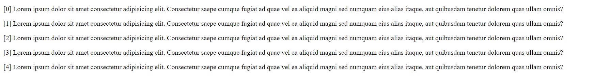
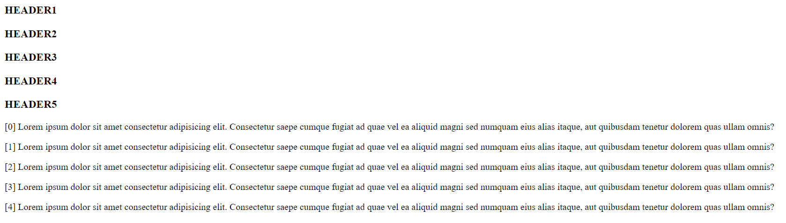

# Първа задача

a) Създайте HTML документ 
b) С Javascript код създайте пет параграфа (може да ползвате първите пет изречения от параграф на книга, по избор) 
c) Тествайте:
    
d) След това допълнете примера: създайте с HTML пет празни тага &lt;h3>&lt;/h3>, а след това с JavaScript код им създайте текст от предишния пример, като използвате метода getElementById(), на обекта document (За да изпълните това е необходимо да създадете подходящи атрибути – id). Тествайте:
    
